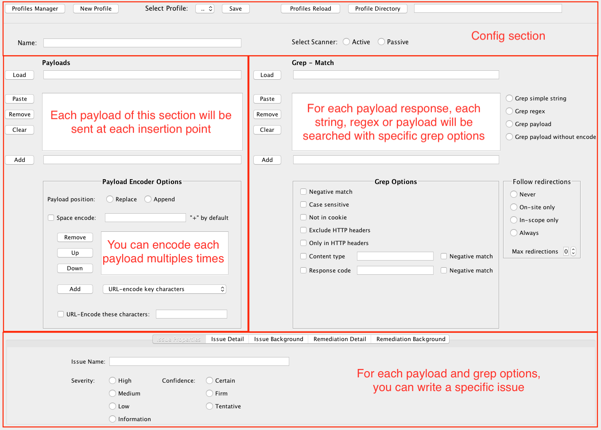

# Burp Bounty - Scan Check Builder (BApps Store)

Download releases:

* https://github.com/wagiro/BurpBounty/releases/

This BurpSuite extension allows you, in a quick and simple way, to improve the active and passive burpsuite scanner by means of personalized rules through a very intuitive graphical interface. Through an advanced search of patterns and an improvement of the payload to send, we can create our own issue profiles both in the active scanner and in the passive.

## Usage:

* Go to [Usage](https://github.com/wagiro/BurpBounty/wiki/usage) section.

## Profile Examples

* [Generic](https://github.com/wagiro/BurpBounty/tree/master/profile_examples/)

## Original profiles from authors

* Profiles from [Xer0dayz](https://twitter.com/xer0dayz) in their [Github](https://github.com/1N3/IntruderPayloads/tree/master/BurpBountyPayloads)

##  Changelog
**2.0 20181020**
* Add the burpcollaborator support
* Follow redirects and how many to follow
* Payload append or replace
* Space encoding choose
* Response codes to avoid
* Content type to avoid
 

**1.2 20180607**
 - Solved bug with payload space
 - Add "Exclude HTTP Headers" feature
 - Add "Only in HTTP Headers" feature
 
**1.1 20180606**
 - Some improvements for integrate with the BApps Store
 
**1.0 20180531**
 - First public release

### For example videos please visit our youtube channel (Examples for version 1.2, soon examples for version 2.0):

* [YouTube](https://www.youtube.com/channel/UCSq4R2o9_nGIMHWZ4H98GkQ/videos)

### Contributions and feature requests are welcome!

