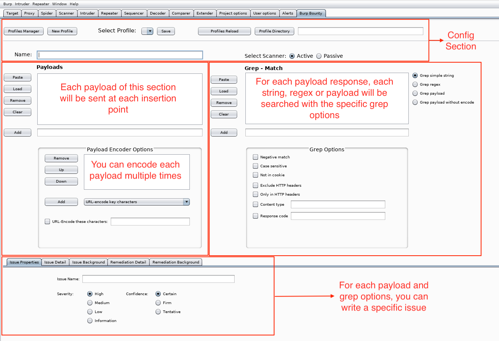
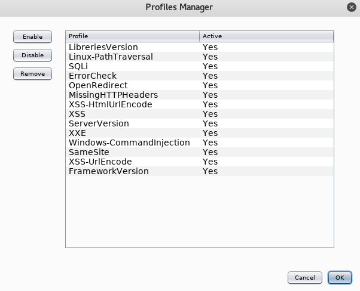

# Burp Bounty - Scan Check Builder (BApps Store)

Download releases:

* https://github.com/wagiro/BurpBounty/releases/

This extension allows you, in a quick and simple way, to improve the active and passive burpsuite scanner by means of personalized rules through a very intuitive graphical interface. Through an advanced search of patterns and an improvement of the payload to send, we can create our own issue profiles both in the active scanner and in the passive.

## - Usage:

#### 1. Config section

* Profile Manager: you can manage the profiles, enable, disable o remove any of them.
* Select Profile: you can choose any profile, for modify it and save. 
* Profiles reload: you can reload the profiles directory, for example, when you add new external profile to directory.
* Profile Directory: you choose the profiles directory path.

#### 2. Payloads
* You can add many payloads as you want.
* Each payload of this secction will be sent at each entry point (Insertion points provided by the burp api)
* You can choos multiple Enocders. For example, if you want encode the string alert(1), many times (in descendent order):
  1. Plain text: alert(1)
  2. HTML-encode all characters: &#x61\;&#x6c\;&#x65\;&#x72\;&#x74\;&#x28\;&#x31\;&#x29\;
  3. URL-encode all characters: %26%23%78%36%31%3b%26%23%78%36%63%3b%26%23%78%36%35%3b%26%23%78%37%32%3b%26%23%78%37%34%3b%26%23%78%32%38%3b%26%23%78%33%31%3b%26%23%78%32%39%3b
  
  4. Base64-encode: JTI2JTIzJTc4JTM2JTMxJTNiJTI2JTIzJTc4JTM2JTYzJTNiJTI2JTIzJTc4JTM2JTM1JTNiJTI2JTIzJTc4JTM3JTMyJTNiJTI2JTIzJTc4JTM3JTM0JTNiJTI2JTIzJTc4JTMyJTM4JTNiJTI2JTIzJTc4JTMzJTMxJTNiJTI2JTIzJTc4JTMyJTM5JTNi

* If you choose "URL-Encode these characters" option, you can put all characters that you want encode with URL.

#### 3. Grep - Match
* For each payload response, each string, regex or payload (depending of you choose) will be searched with the specific Grep Options.
* Grep Type:
  * Simple String: search for a simple string or strings
  * Regex: search for regular expression
  * Payload: search for payloads sended
  * Payload without encode: if you encode the payload, and you want find for original payload, you should choose this

* Grep Options:
  * Negative match: if you want find if string, regex or payload is not present in response
  * Case sensitive: Only match if case sensitive
  * Not in cookie: if you want find if any cookie attribute is not present
  * Content type: you can specify one or multiple (separated by comma) content type to search the string, regex or payload. For example: text/plain, text/html, ...
  * Response Code: you can specify one or multiple (separated by coma) HTTP response code to find string, regex or payload. For example. 300, 302, 400, ...

#### 4. Write an Issue
* In this section you can specify the issue that will be show if the condition match with the options specified.
* Issue Name
* Severity
* Confidence 
* And others details like description, background, etc.

## - Examples

So, the vulnerabilities identified so far, from which you can make personalized improvements are:

#### 1- Active Scan

* XSS reflected and Stored
* SQL Injection error based
* XXE
* Command injection
* Open Redirect
* Local File Inclusion
* Remote File Inclusion
* Path Traversal
* LDAP Injection
* ORM Injection
* XML Injection
* SSI Injection
* XPath Injection
* etc

#### 2- Passive Scan

* Security Headers
* Cookies attributes
* Software versions
* Error strings
* In general any string or regular expression.

#### For example videos please visit our youtube channel:

* [YouTube](https://www.youtube.com/channel/UCSq4R2o9_nGIMHWZ4H98GkQ/videos)

## - Improvements for version 2.0:

* Add the burpcollaborator, to find blind vulnerabilities
* Follow redirects and how many to follow
* Processing cookies in redirect
* Regular expression in content type
* Response codes to avoid
* Content type to avoid
* Search only in HTTP Headers
* Exclude HTTP headers from the search
* Add option to insert new headers in the requests.

##  Changelog
**1.2 20180607**
 - Solved bug with payload space
 - Add "Exclude HTTP Headers" feature
 - Add "Only in HTTP Headers" feature
 
**1.1 20180606**
 - Some improvements for integrate with the BApps Store
 
**1.0 20180531**
 - First public release

### Contributions and feature requests are welcome!

### If you want that I upload your profile example video, send it to me and I upload in my youtube channel.
